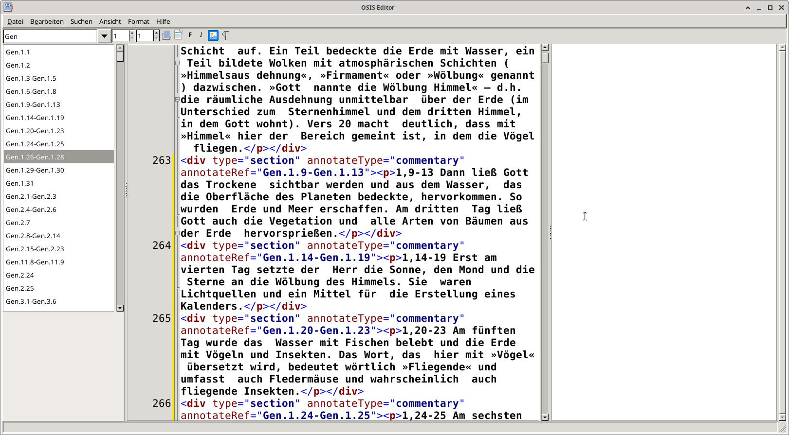

# OSISEditor

  

  <h3 align="center">OSISEditor</h3>

  

    This editor helps to edit OSIS-files for the SWORD Project by CrossWire
     
    <a href="https://www.crosswire.org/sword/index.jsp"><strong>Explore Sword Project »</strong></a>
     
    <a href="https://wiki.crosswire.org/Main_Page"><strong>CrossWire developers' wiki »</strong></a>
  

## Getting Started

Download the latest release for Linux and start. 

For other OS: Build from source using Lazarus.
