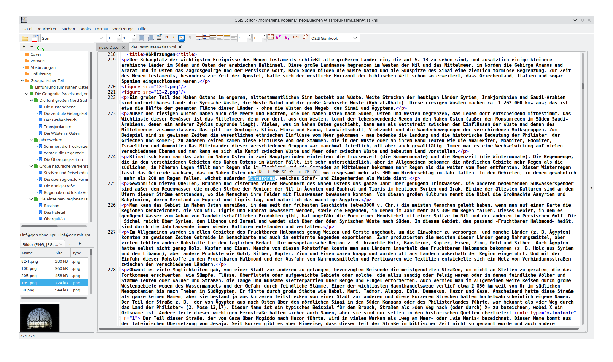

# OSISEditor

  

  

  <h3 align="center">OSISEditor</h3>
  
  

    This editor helps to edit OSIS-files for the SWORD Project by CrossWire. Runs on GNU/Linux, Mac OS X, and Windows.
     
    <a href="https://www.crosswire.org/sword/index.jsp"><strong>Explore Sword Project »</strong></a>
     
    <a href="https://wiki.crosswire.org/Main_Page"><strong>CrossWire developers' wiki »</strong></a>
  

## Features

OSISEditor provides a rich environment to help content creation of OSIS Bibles, Genbooks, Commentaries and TEI Dictionaries.
With OSISEditor you can:

* Summarize the content of modules
* Edit all textmodules
* Quickly annotate XML
* Use helpers like Synax-Checking, Biblelinks annotations etc.
* Copy and repair text from OCR (e.g., line breaks)

## Getting Started

Download the latest release for Linux and start. 

For other OS: Build from source using Lazarus.

## Old Screenhots:

  
  

    v. 0.1
  

  

